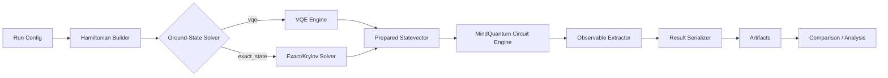
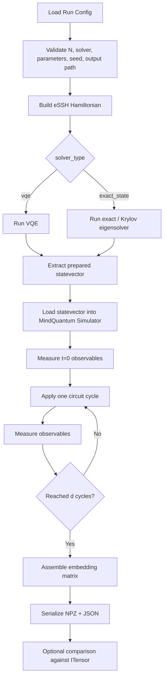
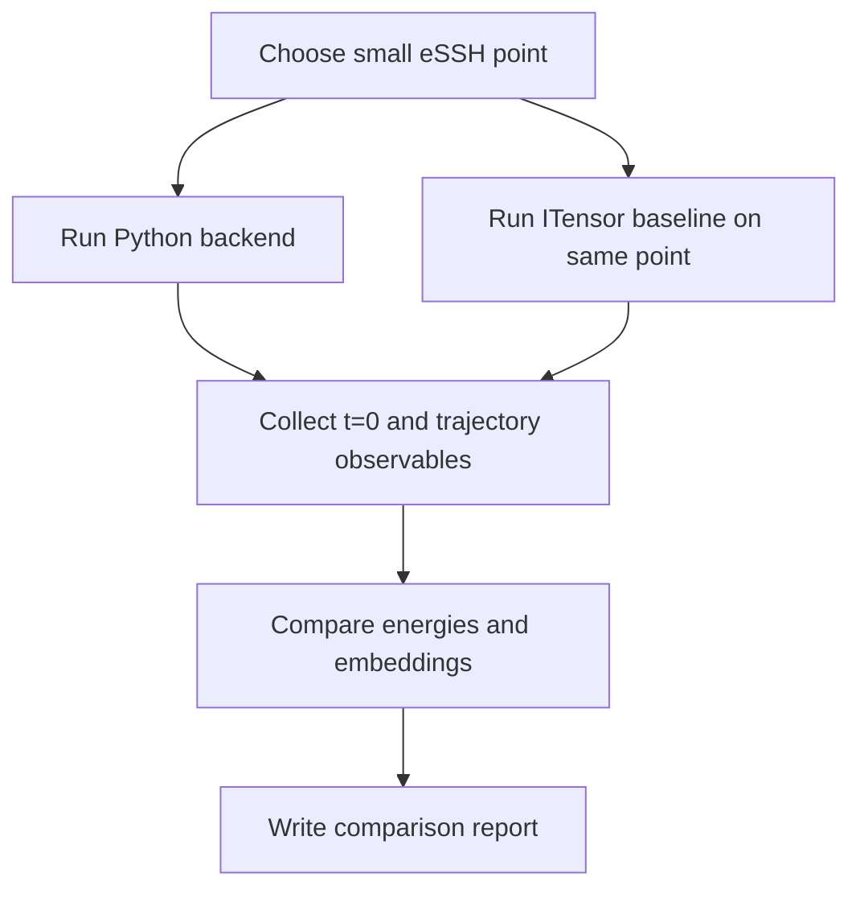

# Technical Design: Python Backend with MindQuantum Circuit Evolution and Multiple Ground-State Solvers

## 1. Document Control
- **Project**: qrc-phase
- **Design Stage**: Technical Design
- **Date**: 2026-04-08
- **Status**: Draft for review
- **Related Requirements**: `requirements.md:1-369`

## 2. Design Overview
This document defines the technical design for a new **Python-only backend** that:
1. constructs the target lattice Hamiltonian,
2. prepares the ground state using a selectable solver,
3. converts or preserves that ground state as a statevector,
4. injects that statevector into a MindQuantum simulator,
5. applies the repeated circuit used by the current notebook workflow,
6. extracts the same embedding observables,
7. stores comparison-ready outputs.

The design is grounded in the current repository workflow:
- eSSH Hamiltonian definition in `hamiltonian.jl:123-141`
- DMRG ground-state generation in `getessh.jl:11-69`
- ground-state loading plus circuit-stage execution in `getemb.jl:14-30`
- repeated-circuit and embedding logic in `get_trivial_state_emb.ipynb:36-65`, `get_sb_state_emb.ipynb:36-64`, and `get_topo_state_emb.ipynb:83-112`

This design intentionally targets **small systems only**. Based on requirements review and user confirmation, the target scale is roughly **10–16 qubits**, with explicit runtime guardrails and no claim of replacing the existing 128-site tensor-network workflow (`requirements.md:69-97`, `requirements.md:362-369`).

## 3. Design Goals

### 3.1 Primary Goals
- Provide a pure Python implementation of the workflow “ground state -> repeated circuit -> embedding”.
- Use **MindQuantum only for circuit evolution and observable evaluation on statevectors**.
- Support two ground-state preparation modes:
  - `vqe`
  - `exact_state`
- Keep the new backend isolated from the existing Julia + ITensor production path.
- Preserve the observable contract used by the current notebooks.
- Make the workflow reproducible and comparison-friendly.

### 3.2 Non-Goals
- Replacing the ITensor/MPS production workflow for `N = 128`.
- Reusing ITensor HDF5 MPS as the primary state interchange format.
- Supporting every Hamiltonian in `hamiltonian.jl:4-196` in v1.
- Reproducing the exact hidden API of the missing `dtc_circuit.jl`.
- Adding a new Julia implementation for the new backend.

## 4. Current-State Analysis and Design Boundary
The current repository has a natural four-stage structure:
1. **Hamiltonian construction** in `hamiltonian.jl:4-196`
2. **Ground-state preparation** with DMRG in `getmps.jl:52-73` and `getessh.jl:23-69`
3. **Circuit continuation** in `getemb.jl:14-30`
4. **Observable extraction** in the notebooks `get_trivial_state_emb.ipynb:47-65`, `get_sb_state_emb.ipynb:47-64`, `get_topo_state_emb.ipynb:94-111`

The clean replacement boundary is therefore:
- keep the **physics definition** compatible,
- replace the **ground-state backend** with Python solvers that output statevectors,
- replace the **circuit backend** with MindQuantum statevector evolution,
- preserve the **observable semantics**,
- define a new, explicit output schema.

## 5. High-Level Architecture

### 5.1 Chosen Architecture
The new functionality will be implemented as a **Python sidecar backend** inside the repository.

### 5.2 Why Python-Only
The user explicitly requested that the new feature use Python rather than Julia. This also matches the practical integration boundary because MindQuantum is Python-native.

### 5.3 Ground-State Solver Split
The design separates the workflow into:
- a **Hamiltonian specification layer**,
- a **ground-state solver layer**,
- a **MindQuantum circuit-evolution layer**,
- an **observable extraction layer**,
- an **artifact / comparison layer**.

This is necessary because the circuit simulator and the ground-state solver are no longer required to be the same implementation technology.

### 5.4 Logical Component Diagram


### 5.5 Physical Module Layout
Proposed file layout for v1:

```text
qrc-phase/
  py_backend/
    __init__.py
    config.py
    hamiltonians.py
    solvers/
      __init__.py
      base.py
      vqe.py
      exact_state.py
    repeated_circuit.py
    observables.py
    io.py
    compare_itensor.py
  scripts/
    run_py_essh.py
```

## 6. Core Design Decisions

### DD-1. First-version Hamiltonian scope = eSSH only
The first implementation will support **eSSH only**.

Reason:
- eSSH is the most complete active path in the repository (`hamiltonian.jl:123-141`, `getessh.jl:11-69`, `getemb.jl:14-30`).
- It is the only family with a clear ground-state generation path and downstream embedding path already in use.

### DD-2. First-version system size cap = explicit small-system guardrail
The new backend will enforce:
- **recommended range**: 10–16 qubits
- **hard upper bound in v1**: 20 qubits

Reason:
- current production scripts are at `N = 128` (`getessh.jl:11`, `getemb.jl:14`), which is incompatible with exact statevector expectations;
- exact-state solvers and MindQuantum statevector simulation both scale exponentially.

Behavior:
- if `N > 20`, the backend fails before starting any solver.
- if the selected exact-state method is incompatible with the matrix size or memory budget, the run exits with a clear error.

### DD-3. Python-only implementation
All new logic for this feature will live in Python modules.

Reason:
- explicit user requirement;
- avoids mixed-language operational complexity;
- allows direct use of MindQuantum, NumPy, and SciPy.

### DD-4. Use an in-memory ground-state -> circuit handoff
The primary handoff contract will be in memory, not via intermediate HDF5.

Reason:
- requirements explicitly forbid mandatory file round-tripping at this boundary (`requirements.md:176-180`);
- both VQE and exact-state solvers naturally produce statevectors;
- HDF5/MPS is ITensor-specific and not the correct native interchange for this backend.

### DD-5. Preserve notebook observable semantics as canonical
The canonical embedding contract will follow the notebooks rather than the missing helper interface.

Observable ordering:
1. `Z[1] ... Z[N]`
2. `ZZ[1,2] ... ZZ[N-1,N]`

Time indexing:
- column `0` = measurements on the prepared ground state
- columns `1..d` = measurements after each repeated-circuit cycle

Matrix shape:
- `(2N - 1, d + 1)`

This is grounded in `get_trivial_state_emb.ipynb:47-65`, `get_sb_state_emb.ipynb:47-64`, `get_topo_state_emb.ipynb:94-111`.

### DD-6. Use explicit circuit parameters, not hidden random generation
The repeated circuit stage will accept fully materialized angle arrays as the canonical internal interface:
- `rx_angles[N]`
- `rz_angles[N]`
- `rzz_angles[N-1]`

An outer utility may generate these arrays from a seed and generation rule, but the circuit engine itself will consume explicit arrays.

Reason:
- the current repo is ambiguous because `getemb.jl` passes only scalar `g` to the missing helper (`getemb.jl:16-25`), while notebooks expand scalar `g` and separately sample random `jz` / `jzz` (`get_trivial_state_emb.ipynb:36-55`, `get_sb_state_emb.ipynb:36-55`, `get_topo_state_emb.ipynb:86-102`);
- explicit arrays maximize reproducibility and comparison correctness.

### DD-7. Canonical output = NPZ for arrays + JSON for metadata
The new backend will use:
- `result.npz` for numeric arrays,
- `metadata.json` for structured metadata.

Reason:
- current CSV output is ambiguous in shape semantics (`getemb.jl:27-30`);
- current MPS/HDF5 output is backend-specific (`getessh.jl:57-63`);
- NPZ is compact and suitable for exact numeric artifacts.

### DD-8. `exact_state` is a Python eigensolver feature, not Julia KrylovKit
The user requested an additional feature equivalent to “exact diagonalization (or KrylovKit) -> statevector -> circuit evolution”. Since the new feature must be Python-only, v1 will implement this through Python numerical linear algebra, not Julia KrylovKit.

Chosen interpretation for v1:
- **dense exact diagonalization** for very small systems,
- **SciPy sparse Lanczos / Krylov-style eigensolver** for larger but still bounded systems.

This satisfies the requested capability while remaining Python-only.

## 7. End-to-End Workflow Design

### 7.1 Primary Runtime Flow


### 7.2 Comparison Flow


## 8. Module Design

## 8.1 `py_backend/config.py`
Responsible for typed run configuration and validation.

### Responsibilities
- Define config objects.
- Validate required fields.
- Normalize defaults.
- Enforce small-system guardrails.
- Enforce solver-specific parameter rules.

### Config Model
#### HamiltonianConfig
- `family: str = "essh"`
- `N: int`
- `J1: float`
- `J2: float`
- `delta: float`
- `periodic: bool = False`
- `penalty_z1: float = 0.01`

#### SolverConfig
- `solver_type: str` where allowed values are `"vqe"` or `"exact_state"`
- `method: str`
- `seed: int | None`
- `tolerance: float`
- `maxiter: int | None`

#### VQEConfig
- `ansatz_name: str`
- `ansatz_depth: int`
- `optimizer_name: str`
- `maxiter: int`
- `tol: float`
- `seed: int`
- `initial_state_mode: str`

#### ExactStateConfig
- `method: str` where allowed values are `"dense_eigh"`, `"sparse_eigsh"`, or `"auto"`
- `dense_qubit_threshold: int`
- `which: str`
- `k: int`
- `tol: float`
- `maxiter: int | None`

#### CircuitConfig
- `depth_d: int`
- `rx_angles: list[float] | None`
- `rz_angles: list[float] | None`
- `rzz_angles: list[float] | None`
- `angle_generation_rule: dict | None`

#### RuntimeConfig
- `mq_backend_name: str = "mqvector"`
- `dtype: str = "complex128"`
- `max_qubits: int = 20`
- `threads: int | None`

#### OutputConfig
- `output_dir: str`
- `save_final_statevector: bool`
- `schema_version: str = "py-mq-v1"`

## 8.2 `py_backend/hamiltonians.py`
Responsible for building Hamiltonians matching the repository’s physical model definitions.

### Responsibilities
- Translate eSSH from `hamiltonian.jl:123-141` into:
  - a sparse / dense matrix form for exact-state solvers,
  - a QubitOperator / Hamiltonian form suitable for MindQuantum VQE expectations.
- Keep coefficient conventions identical.
- Expose metadata for comparison.

### eSSH Construction Contract
For open boundary conditions:
- for bond `(i, i+1)` use `J = J1` on odd bonds and `J = J2` on even bonds;
- add `J * X_i X_{i+1}`;
- add `J * Y_i Y_{i+1}`;
- add `J * delta * Z_i Z_{i+1}`;
- add `0.01 * Z_1` penalty.

### Output Contract
Returns a `HamiltonianBundle` containing:
- `family`
- `num_qubits`
- `params`
- `mq_hamiltonian` for VQE and expectation calls
- `sparse_matrix` for exact-state eigensolver usage
- `dense_matrix` lazily materialized only if required

## 8.3 `py_backend/solvers/base.py`
Defines the solver interface.

### API
```python
solve_ground_state(
    hamiltonian_bundle,
    solver_config,
    runtime_config,
) -> PreparedState
```

### `PreparedState` Data Contract
- `solver_type: str`
- `solver_method: str`
- `backend: str`
- `num_qubits: int`
- `hamiltonian_family: str`
- `hamiltonian_params: dict`
- `energy: float`
- `statevector: np.ndarray`
- `solver_summary: dict`
- `seed: int | None`

This shared contract is the unifying boundary between both ground-state solvers and the MindQuantum circuit stage.

## 8.4 `py_backend/solvers/vqe.py`
Responsible for VQE ground-state preparation.

### Chosen v1 Ansatz
The first implementation will use a **hardware-efficient nearest-neighbor ansatz** with:
- initial product state = Neel state `|0101...>` to mirror the repository’s current initialization pattern (`getmps.jl:59-60`, `getessh.jl:17-19`),
- per-layer single-qubit rotations,
- alternating nearest-neighbor entangling blocks on even and odd bonds.

### Why this ansatz
- simple to implement in MindQuantum,
- general enough for small spin-chain validation,
- does not depend on chemistry-specific tooling such as UCCSD,
- matches the repository’s spin-lattice use case better than molecule-specific ansatz tutorials.

### Chosen v1 Optimizer
Use **SciPy L-BFGS-B** with gradients from MindQuantum.

Reason:
- MindQuantum supports expectation-with-gradient workflows suitable for VQE;
- SciPy-based optimization is aligned with official tutorial patterns;
- L-BFGS-B is more scalable than plain BFGS when parameter count grows.

### VQE Runtime Contract
1. create a MindQuantum `Simulator('mqvector', N)`;
2. build preparation circuit + parameterized ansatz;
3. build expectation-with-gradient closure against the eSSH Hamiltonian;
4. optimize parameters;
5. evaluate final statevector;
6. return `PreparedState`.

### Output Summary Fields
- `final_energy`
- `optimized_params`
- `optimizer_name`
- `iterations`
- `converged`
- `final_gradient_norm` if available

## 8.5 `py_backend/solvers/exact_state.py`
Responsible for exact-state ground-state preparation.

### Purpose
Provide the requested feature:
- compute a ground-state **statevector** using exact diagonalization or a Krylov-style eigensolver,
- then feed that statevector directly into the quantum circuit for evolution.

### Supported Methods
#### Method A: `dense_eigh`
Use dense Hermitian diagonalization for very small systems.

Intended use:
- small matrices where dense materialization is inexpensive,
- reference-quality results.

#### Method B: `sparse_eigsh`
Use SciPy’s sparse Hermitian eigensolver as the Python-side Krylov/Lanczos method.

Intended use:
- larger bounded systems where sparse operator application is still feasible,
- ground-state extraction without full dense diagonalization.

#### Method C: `auto`
Select method by problem size:
- if `N <= dense_qubit_threshold`, use `dense_eigh`
- otherwise use `sparse_eigsh`

### Why not KrylovKit directly
KrylovKit is part of the Julia ecosystem, but the new feature must be Python-only. Therefore, the v1 design uses Python-side Krylov-style functionality via SciPy rather than Julia KrylovKit.

### Exact-State Runtime Contract
1. build sparse eSSH Hamiltonian matrix;
2. choose dense or sparse eigensolver according to `method`;
3. compute lowest algebraic eigenpair;
4. normalize the eigenvector to canonical statevector form;
5. return `PreparedState`.

### Dense Path Details
- materialize the Hamiltonian as a dense Hermitian matrix;
- compute the lowest eigenpair with dense Hermitian diagonalization;
- use this as the reference exact ground state.

### Sparse Path Details
- keep the Hamiltonian as sparse Hermitian operator;
- use a smallest-algebraic eigenpair request;
- expose convergence / iteration metadata if available.

### Output Summary Fields
- `ground_energy`
- `residual_norm` if available
- `matrix_dimension`
- `nnz` for sparse path
- `solver_converged`
- `selected_method`

## 8.6 `py_backend/repeated_circuit.py`
Responsible for applying the post-ground-state repeated circuit in MindQuantum.

### Circuit Contract
Each cycle implements:
1. `Rx(rx_angles[i])` for each qubit `i`
2. `Rzz(rzz_angles[i])` for each nearest-neighbor bond `(i, i+1)`
3. `Rz(rz_angles[i])` for each qubit `i`

This is directly derived from notebook behavior in `get_trivial_state_emb.ipynb:52-64`, `get_sb_state_emb.ipynb:52-64`, and `get_topo_state_emb.ipynb:99-111`.

### API
```python
run_repeated_circuit(
    prepared_state,
    circuit_config,
    runtime_config,
) -> TrajectoryResult
```

### `TrajectoryResult` Data Contract
- `embedding_matrix: np.ndarray`
- `observable_order: list[str]`
- `time_steps: list[int]`
- `circuit_params: dict`
- `initial_energy: float`
- `solver_type: str`
- `solver_method: str`
- `final_statevector: np.ndarray | None`
- `metadata: dict`

### State Injection Strategy
1. initialize `Simulator('mqvector', N)`;
2. call `set_qs(prepared_state.statevector)`;
3. measure `t=0` observables;
4. apply one repeated-circuit layer at a time;
5. measure after each cycle.

This is the key feature requested by the user: direct statevector injection before circuit evolution.

## 8.7 `py_backend/observables.py`
Responsible for extracting observables.

### Canonical Observable Set
At each time slice:
- `Z_i` for `i = 1..N`
- `Z_i Z_{i+1}` for `i = 1..N-1`

### Important Design Choice
Do **not** build the full `N x N` correlation matrix and then slice nearest-neighbor terms.

Reason:
- current notebooks do this indirectly (`get_trivial_state_emb.ipynb:47-49`, `get_topo_state_emb.ipynb:94-110`),
- only nearest-neighbor terms are actually needed,
- direct expectation evaluation is simpler and avoids unnecessary cost.

### API
```python
measure_embedding_snapshot(simulator, num_qubits) -> np.ndarray
build_observable_order(num_qubits) -> list[str]
```

The snapshot function operates directly on the MindQuantum simulator after state injection and after each circuit application.

## 8.8 `py_backend/io.py`
Responsible for persistence.

### Canonical Artifact Set
Each run produces:
- `result.npz`
  - `embedding_matrix`
  - `rx_angles`
  - `rz_angles`
  - `rzz_angles`
  - optional `final_statevector`
- `metadata.json`
  - circuit backend info
  - Hamiltonian config
  - solver config
  - circuit config summary
  - solver summary
  - seed
  - observable ordering
  - schema version

### Output Directory Pattern
Canonical path:
```text
data/python-mq/eSSH/N{N}/delta{delta}/J2{J2}/{solver_type}_{solver_method}/d{d}_seed{seed}/
```

This avoids ambiguity and explicitly records which ground-state path produced the artifact.

## 8.9 `py_backend/compare_itensor.py`
Responsible for optional backend comparison.

### Responsibilities
- Compare Python-backend outputs against small-system ITensor reference runs.
- Compute quantitative differences.
- Persist a comparison report.

### Comparison Metrics
- `abs(energy_python - energy_itensor)`
- maximum absolute error of `t=0` `Z_i`
- maximum absolute error of `t=0` nearest-neighbor `ZZ`
- maximum absolute error over the full embedding matrix

### Important Comparison Note
Cross-backend comparison is performed at the **observable trajectory level**, not by comparing raw state containers, because the legacy backend uses MPS/HDF5 while the new backend uses statevectors.

## 8.10 `scripts/run_py_essh.py`
Top-level entrypoint for v1.

### Responsibilities
- parse run arguments,
- load config,
- call validation,
- build Hamiltonian,
- dispatch to selected solver,
- run repeated circuit,
- save outputs,
- optionally call comparison mode.

## 9. Data Model and State Handoff

### 9.1 Why Statevector is the v1 handoff representation
For 10–16 qubits, statevector handoff is simple, exact, and compatible with both solver paths.

### 9.2 Handoff Sequence
1. run selected ground-state solver;
2. obtain normalized statevector;
3. initialize a fresh MindQuantum simulator with that statevector;
4. apply the repeated circuit one cycle at a time;
5. measure after each cycle.

This avoids accidental state contamination and makes the solver phase and circuit phase independently testable.

### 9.3 Simulator Strategy
- default runtime backend: `mqvector`
- default dtype: `complex128`
- no GPU assumption in v1

Reason:
- small-system exact validation is the goal,
- double precision is preferable for energy comparison,
- CPU-first behavior is simpler and more portable.

## 10. Circuit Parameter Strategy

### 10.1 Canonical Internal Representation
The repeated-circuit engine consumes only explicit arrays:
- `rx_angles`
- `rz_angles`
- `rzz_angles`

### 10.2 Supported External Input Modes
#### Mode A: Explicit Arrays
Caller supplies all arrays directly.

#### Mode B: Seeded Rule Generation
Caller supplies:
- scalar control `g_scalar`
- random seed
- generation ranges for `rz_angles` and `rzz_angles`

The system deterministically materializes arrays and then stores them into artifacts.

### 10.3 Resolution of Current Ambiguity
The current repo mixes:
- scalar `g` passed to missing helper (`getemb.jl:16-25`),
- `g * π` expansion plus random `jz`/`jzz` in notebooks (`get_trivial_state_emb.ipynb:36-55`, `get_sb_state_emb.ipynb:36-55`).

The new design resolves this by making angle arrays explicit before circuit execution.

## 11. Validation and Testing Design

### 11.1 Unit-Level Validation
- eSSH Hamiltonian builder produces the expected term count and coefficient pattern.
- statevector normalization is enforced after both solver paths.
- observable extractor returns length `2N-1` with the canonical order.
- seeded parameter generation is deterministic.
- guardrails reject `N > 20`.

### 11.2 VQE Integration Validation
A VQE-path integration test must execute:
1. Hamiltonian construction,
2. VQE convergence,
3. state handoff,
4. repeated circuit application,
5. embedding serialization.

### 11.3 Exact-State Integration Validation
An exact-state integration test must execute:
1. Hamiltonian construction,
2. exact diagonalization or sparse eigensolver convergence,
3. statevector handoff into MindQuantum,
4. repeated circuit application,
5. embedding serialization.

### 11.4 Cross-Backend Validation
For a small eSSH point:
- use identical `N`, `J1`, `J2`, `delta`, `periodic`, and circuit arrays,
- compare `t=0` observables,
- compare full trajectory embeddings.

### 11.5 Minimum Comparison Cases
At minimum include:
- one trivial-like regime,
- one near-transition regime,
- one topological-like regime,
all at small `N`.

### 11.6 Cross-Solver Validation
For at least one small eSSH point, compare:
- `vqe` energy vs `exact_state` energy,
- `vqe` `t=0` observables vs `exact_state` `t=0` observables,
- full embedding trajectory consistency under identical circuit parameters.

## 12. Error Handling Design
The runtime must fail early with actionable messages for:
- unsupported Hamiltonian family,
- invalid parameter shape,
- missing angle arrays after config resolution,
- unsupported qubit count,
- MindQuantum import/runtime failure,
- VQE non-convergence,
- exact-state eigensolver failure,
- output write failure.

No silent fallback between solver modes is allowed (`requirements.md:263-273`).

## 13. Known Risks and Mitigations

### Risk 1. Missing `dtc_circuit.jl` leaves current script behavior under-specified
**Mitigation**: use notebook logic, not missing helper behavior, as the canonical circuit/observable contract.

### Risk 2. Gate-angle semantics are ambiguous in the current script path
**Mitigation**: make explicit arrays the only internal circuit API.

### Risk 3. Output layout mismatch with legacy CSV consumers
**Mitigation**: define NPZ + JSON as canonical; add exporters later only if needed.

### Risk 4. VQE ansatz may underfit certain parameter regions
**Mitigation**: make ansatz pluggable, but keep one default ansatz for v1.

### Risk 5. Dense diagonalization can exceed memory sooner than expected
**Mitigation**: use `auto` policy to switch to sparse eigensolver and guardrail dense materialization.

### Risk 6. Sparse eigensolver convergence may be sensitive near degeneracies
**Mitigation**: surface method, tolerance, and convergence status in metadata; allow solver-specific tuning.

### Risk 7. Comparison against ITensor may fail if coefficient conventions diverge
**Mitigation**: reuse the exact eSSH operator structure from `hamiltonian.jl:123-141`, including the `0.01 * Z_1` penalty term.

## 14. Alternative Designs Considered

### Alternative A: Julia calls Python MindQuantum directly
**Rejected for v1**.

Reason:
- user explicitly requested Python, not Julia,
- adds inter-language operational complexity,
- not necessary for small-system validation.

### Alternative B: Store intermediate ground states in HDF5 for parity with ITensor
**Rejected as primary design**.

Reason:
- violates the desired in-memory handoff,
- forces backend-specific serialization where it is not needed.

### Alternative C: Reproduce `dtc_circuit.jl` API exactly
**Rejected**.

Reason:
- the file is absent,
- current return semantics differ by caller (`getemb.jl:25-30`, `getemb_clusterising.jl:26-30`),
- explicit contracts are safer.

### Alternative D: Use only VQE and skip the exact-state path
**Rejected**.

Reason:
- does not satisfy the newly requested “exact diagonalization / Krylov-like statevector to circuit” feature,
- weakens validation ability on small systems.

## 15. Implementation Readiness Summary
This design is ready for task breakdown because it now fixes the open design-stage questions from `requirements.md:352-360`:

1. **Host language**: Python-only backend.
2. **Canonical output format**: NPZ + JSON.
3. **Circuit parameter policy**: explicit arrays internally; optional seeded generation externally.
4. **VQE strategy**: hardware-efficient nearest-neighbor ansatz + L-BFGS-B.
5. **Exact-state strategy**: dense exact diagonalization for very small systems, sparse Krylov/Lanczos-style eigensolver for larger bounded systems, and `auto` dispatch.
6. **Hamiltonian scope**: eSSH only in v1.
7. **Comparison strategy**: small-system observable-level validation against ITensor plus cross-solver validation between `vqe` and `exact_state`.

## 16. Final Design Summary
The v1 implementation will add a **Python-only small-system backend** that is cleanly separated from the current Julia + ITensor path, supports **two ground-state preparation modes**:
- **VQE**,
- **exact-state (dense exact diagonalization or sparse Krylov-style eigensolver)**,

then injects the resulting **ground-state statevector directly into a MindQuantum simulator**, continues from that state with the **same repeated circuit structure used in the notebooks**, extracts a **stable `(2N-1, d+1)` embedding matrix**, and saves **comparison-ready artifacts** with explicit metadata.

It is designed for correctness, clarity, solver comparability, and backend validation, not for replacing the repository’s existing large-scale tensor-network production workflow.
